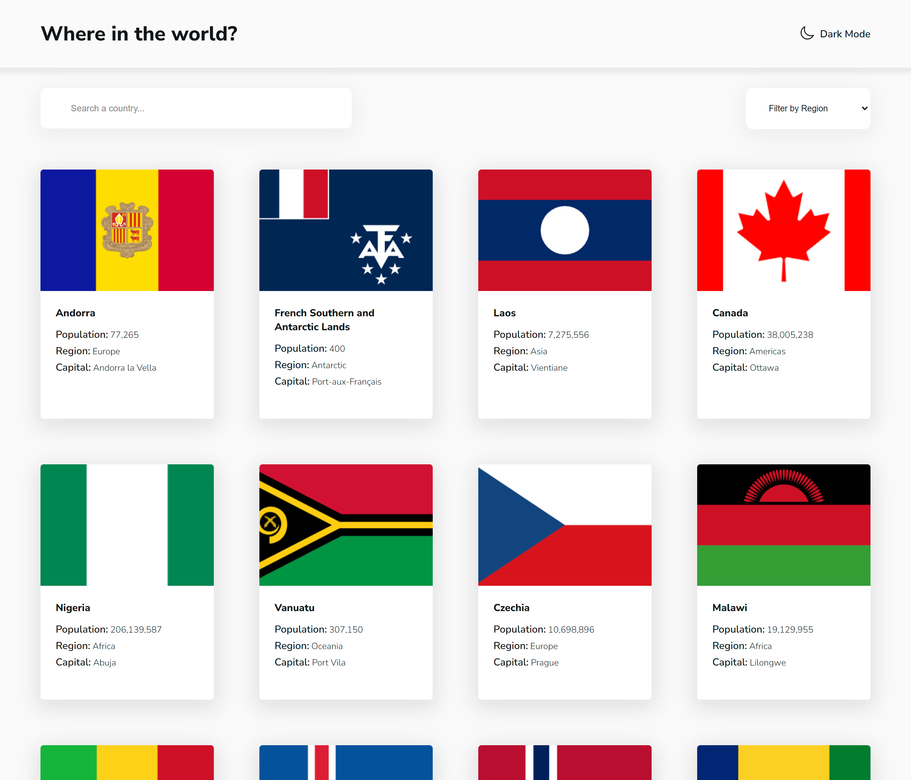

# Frontend Mentor - REST Countries API with color theme switcher solution

This is a solution to the [REST Countries API with color theme switcher challenge on Frontend Mentor](https://www.frontendmentor.io/challenges/rest-countries-api-with-color-theme-switcher-5cacc469fec04111f7b848ca). Frontend Mentor challenges help you improve your coding skills by building realistic projects.

## Table of contents

- [Overview](#overview)
  - [The challenge](#the-challenge)
  - [Screenshot](#screenshot)
  - [Links](#links)
- [My process](#my-process)
  - [Built with](#built-with)
  - [What I learned](#what-i-learned)
  - [Continued development](#continued-development)
  - [Useful resources](#useful-resources)
- [Author](#author)

## Overview

### The challenge

Users should be able to:

- See all countries from the API on the homepage
- Search for a country using an `input` field
- Filter countries by region
- Click on a country to see more detailed information on a separate page
- Click through to the border countries on the detail page
- Toggle the color scheme between light and dark mode _(optional)_

### Screenshot

### Links

- Solution URL: (https://github.com/ygabdn29/rest-countries-solution)
- Live Site URL: (https://ygabdn29-rest-countries.netlify.app/)

## My process

### Built with

- Semantic HTML5 markup
- CSS custom properties
- CSS Module
- CSS Grid
- Flexbox
- Vite
- [React](https://reactjs.org/) - JS library

### What I learned

This is the first challenge that I solved using Vite, ReactJS, CSS Module, and React-Router. I try to implement what I learned from react course that I currently enrolled in. Though for deployment I need to search for it alone instead of following the course and I didn't use all the hooks I learn from the course like useRef or useReduce. Maybe I could try another challenge or refactor this one so that I can try to use different hooks.

### Continued development

I think there are lots of thing that I can improve should I revisiting this challenge in the future:

- The styling of course can be improved, especially the search input where now there is no icon and the select input still needs beeter styling.
- I guess for the homepage implementing a lazy loading mechanism is a nice to have feature. It can improve the intial loading time.
- Some of the logic to fetch data and presenting it is still very rough in my opinion. To whoever reads and review my code maybe you can give me some general pointer on which areas I can improve, becasue I feel like it can be better but I don't know how to do it better.
- In general, because this is my first time actually using ReactJS and other things, I believe should I revisit this challenge there will be lots of thing I would do differently and implement more nice to have feature.

### Useful resources

- [Stackoverflow](https://stackoverflow.com/)
- [CSSTricks](https://css-tricks.com/) - Flexbox and Grid

## Author

- Yoga Budiman
